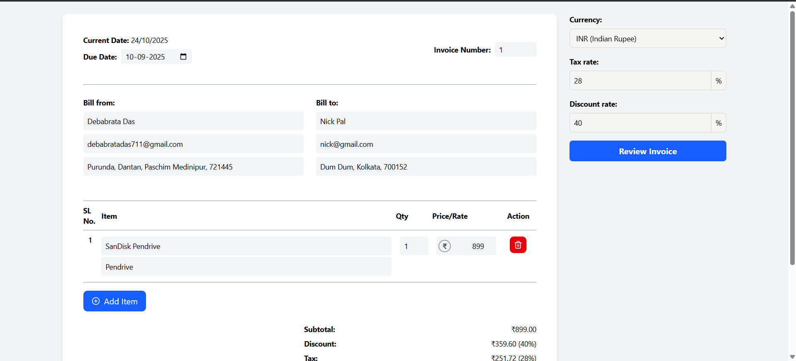

# Invoice Generator

A **frontend-only React application** to generate, download, and send invoices. Built with **React**, **Tailwind CSS**, **html2canvas**, and **jsPDF**.

---

## Screenshots




## Features

- Generate invoice previews dynamically.
- Download invoices as **PDF**.
- Responsive design with **Tailwind CSS**.
- Simple and clean modal overlay for invoice preview.

---

## Tech Stack

- **React** - Frontend UI
- **Tailwind CSS** - Styling
- **html2canvas / html2canvas-pro** - Capture invoice as image
- **jsPDF** - Generate PDF from captured invoice
- **Lucide Icons** - UI icons

---

## Installation

1. Clone the repository:

```bash
git clone https://github.com/dev-debabrata/invoice-generator-react.git
cd invoice-generator
```

2. Install dependencies:

```bash
npm install
```

3. Start the development server:

```bash
npm start
```
